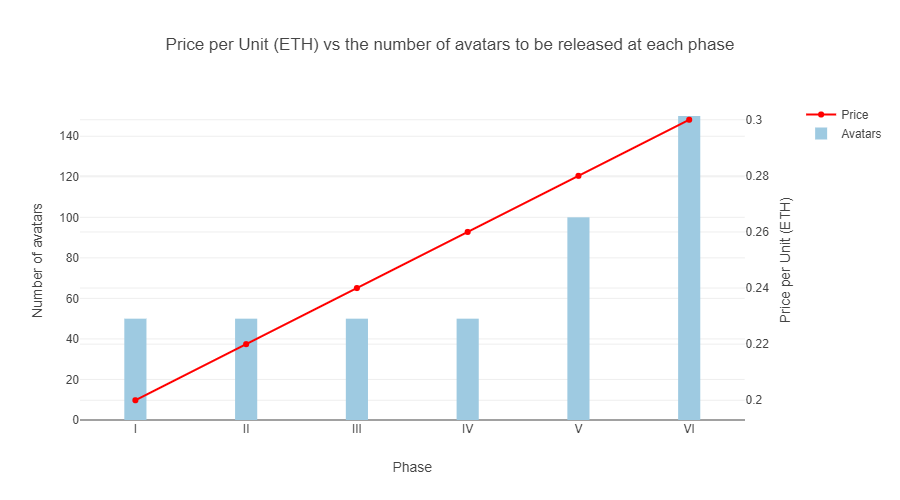

# Basics of tokenomy

The unique combination of Sandbox.io in-game avatars and non-fungible tokens that we offer will be released over a period of six rounds. Every three months a new collection of avatars will be released. In order to establish their value, only a limited number of non-fungible tokens are to be released into the market on each round.

| Phase No. | Number of avatars (Units) | Price per Unit (ETH) |
| --------- | ------------------------- | -------------------- |
| **I**     | 50                        | 0.2                  |
| **II**    | 50                        | 0.22                 |
| **III**   | 50                        | 0.24                 |
| **IV**    | 50                        | 0.26                 |
| **V**     | 100                       | 0.28                 |
| **VI**    | 150                       | 0.3                  |

For example, there will be 50 avatars with a unit price of 0.2 ETH released into the market on the first phase and 150 avatars for 0.3 ETH released into the market on the last phase. There will be 450 avatars produced in total.

